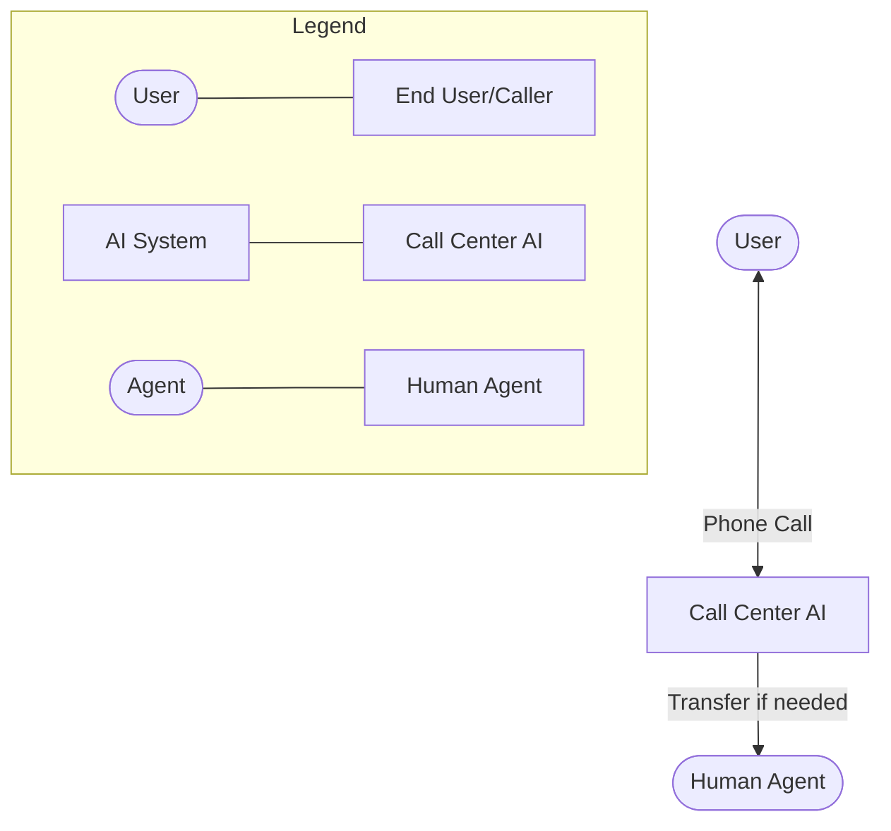
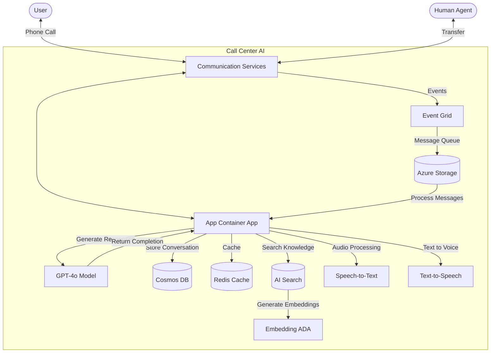
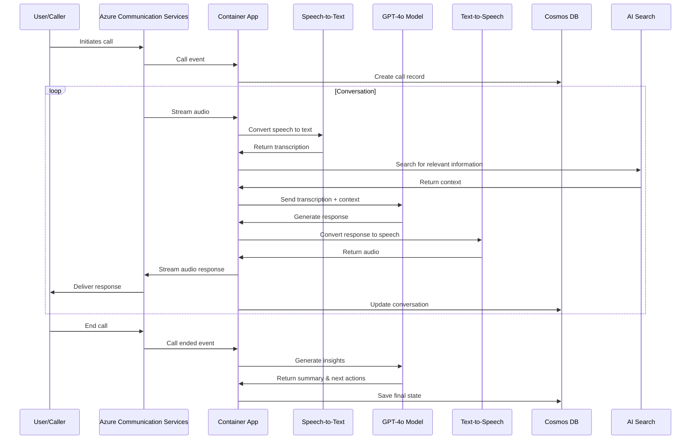
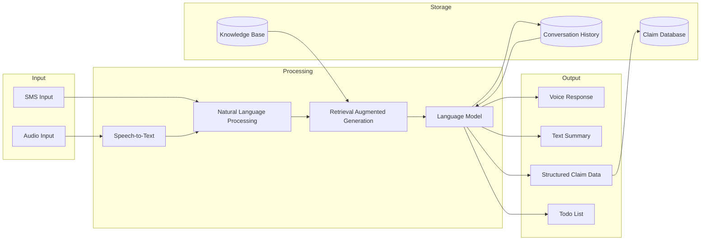
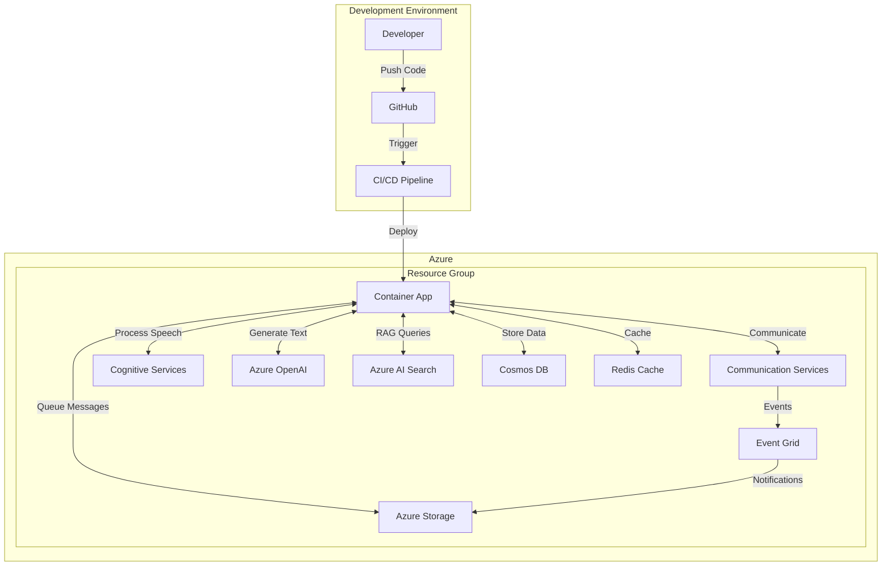

# Microsoft Call Center AI - Architecture Diagrams

This document contains architectural diagrams explaining the structure and flow of the Microsoft Call Center AI solution.

## High Level Architecture

## Component Level Architecture

## Call Flow Sequence

## Data Flow

## Deployment Architecture

